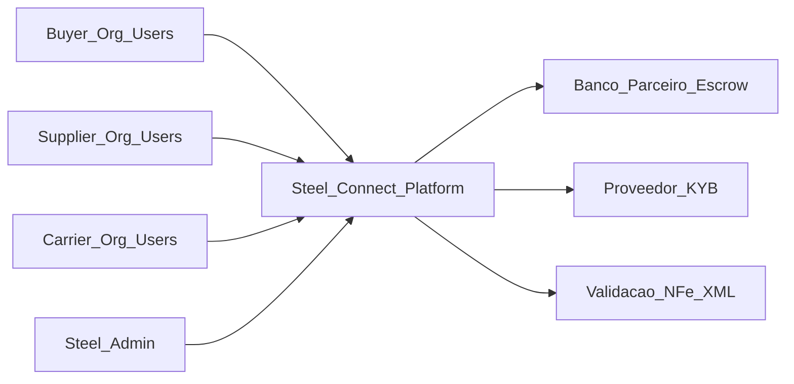
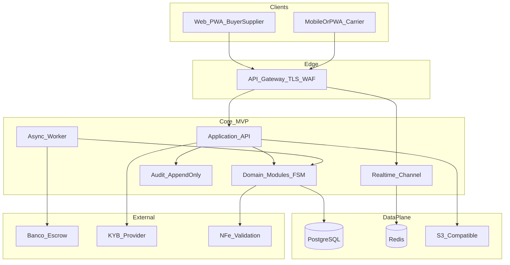

# Steel Connect — Engenharia do MVP (POC → produto)

Documento técnico normalizado: **o que construir**, **com que tecnologias**, **infraestrutura**, **integrações**, **observabilidade** e **ordens de custo** para transformar a POC client-side num MVP operacional.

**Leitores:** engenharia, arquitetura, segurança, parceiros técnicos (banco, KYB), investidores com perfil técnico.

**Relação com outros artefactos**

| Artefacto | Papel |
|-----------|--------|
| [EVOLUCAO_STEELCONNECT.md](./EVOLUCAO_STEELCONNECT.md) | Tese, hipóteses, **recorte de produto** do MVP (§4), roadmap (§5), princípios de arquitetura macro (§6). **Fonte da verdade** para *o quê* e *por quê* de negócio. |
| [README.md](./README.md) | Índice do repositório, stack da POC, como correr o frontend. |
| [poc/frontend/](./poc/frontend/) | Implementação de demonstração: mock em `localStorage`, sem backend persistente. |

Este ficheiro não substitui o EVOLUCAO; concretiza **como** implementar o MVP e **quanto** custa manter em ordem de grandeza.

---

## Índice

1. [Propósito e âmbito](#1-propósito-e-âmbito)
2. [Gap analysis POC → MVP](#2-gap-analysis-poc--mvp)
3. [Arquitetura alvo (C4)](#3-arquitetura-alvo-c4)
4. [Domínios, bounded contexts e eventos](#4-domínios-bounded-contexts-e-eventos)
5. [Stack recomendada e alternativas](#5-stack-recomendada-e-alternativas)
6. [Infraestrutura e ambientes](#6-infraestrutura-e-ambientes) — inclui **organização em 3 repositórios** GitHub
7. [Integrações obrigatórias do MVP](#7-integrações-obrigatórias-do-mvp)
8. [Segurança e compliance](#8-segurança-e-compliance)
9. [Observabilidade e operações](#9-observabilidade-e-operações)
10. [Custos (premissas e faixas)](#10-custos-premissas-e-faixas)
11. [Cronograma técnico sugerido](#11-cronograma-técnico-sugerido)
12. [Riscos técnicos e mitigações](#12-riscos-técnicos-e-mitigações)
13. [Apêndices](#13-apêndices)

---

## 1. Propósito e âmbito

### Objetivo

Definir a baseline técnica executável para o **MVP** alinhado ao §4 do EVOLUCAO (corredor único: vergalhão, Grande SP, design partners, leilão + contrato + escrow + trava fiscal + logística com prova + janela 72h + split).

### Fora do âmbito deste documento

- Escolha final de fornecedor cloud ou banco (apresentam-se **opções** e critérios).
- Código de infra-as-code (**OpenTofu**, compatível com ecossistema Terraform/HCL).
- Duplicação de narrativa estratégica (GTM, modelo de receita detalhado) — ver EVOLUCAO §7–§8.

### Critérios de qualidade do MVP técnico

- Dinheiro e valores monetários: **menor unidade** (centavos) ou `DECIMAL` na BD; **float em APIs é proibido** (principio EVOLUCAO §6).
- Tempo autoritativo: **UTC** no servidor; fuso apenas na UI.
- Operações financeiras: **idempotência** (`Idempotency-Key`) em comandos que movimentam estado de pagamento ou contrato.
- Auditoria: **append-only** para eventos de negócio e administração sensível.

---

## 2. Gap analysis POC → MVP

**Legenda:** `POC` = comportamento actual da demo; `MVP` = requisito mínimo real; `Opc.` = opcional no MVP (recomendação).

| Capacidade | POC (actual) | MVP real |
|------------|----------------|----------|
| Persistência | `localStorage` cifrado (demo) | PostgreSQL (+ migrações versionadas); backups PITR |
| Identidade / sessão | `current_buyer_id` / `current_supplier_id` fixos no mock | OIDC + JWT/session server-side; **Organization** + **User** + RBAC |
| Demandas | Mock services TS | API REST + regras de visibilidade (anonimização até fase definida) |
| Match / seleção | Matches sintéticos | Manifestações de interesse + políticas de convite/selecção persistidas |
| Leilão reverso | Timer client-side; soft close simulado | **Motor no servidor**; WebSocket ou SSE; relógio único; anti-fraude básico (rate limit) |
| RFQ + chat negociação | Modo OFFERS + `negotiation_messages` no mock | **Opc. Wave 1.5:** mesmo fluxo com API + DB; chat pode ser polling MVP ou canal realtime partilhado com leilão |
| Contrato / FSM | Estados em mock | FSM persistida; transições só via comandos válidos + auditoria |
| Escrow / pagamentos | Simulação visual | Integração **parceiro financeiro**; webhooks assinados; reconciliação |
| NF-e / trava fiscal | Upload simulado + regra R$ 1 | Pipeline XML assinado + validação schema + armazenamento imutável |
| Logística / prova | Hash + UI demo | Object storage + metadados + prova criptográfica (contratos com par legal) |
| Notificações | Nenhuma confiável | E-mail transacional; Opc.: WhatsApp BSP |
| Admin / auditoria | Painel mock | RBAC admin; exportação de trilhas; retenção LGPD |

**Recomendação RFQ/chat:** manter **micro-leilão como canónico** no primeiro Go-Live de piloto (EVOLUCAO §4). RFQ + chat podem entrar como **rapid follower** assim que o corredor leilão→contrato→pagamento estiver estável em sandbox real — reduz superfície de integração e realtime no primeiro deploy.

---

## 3. Arquitetura alvo (C4)

### 3.1 Contexto (sistema e actores)



### 3.2 Contentores (MVP recomendado)

**Decisão pragmática:** **monólito modular** (um deployable API + worker de fila) com fronteiras claras entre módulos (*Demand*, *Auction*, *Offers*, *Contract*, *Payments*, *Logistics*, *Notifications*, *Audit*). **Microserviços** adicionam custo operacional e tracing prematuro para o primeiro piloto.

Evitar dupla escrita: preferir **eventos internos** (outbox para Postgres → worker) antes de Kafka gerido, salvo requisito explícito de throughput.



### 3.3 Critérios de pronto (arquitetura)

- Diagrama de rede (VPC, subnets, SG) documentado para prod.
- Secrets fora do repo (vault gerido ou secret manager cloud).
- Um ambiente **staging** espelha prod com dados anonimizados.

---

## 4. Domínios, bounded contexts e eventos

### Bounded contexts (sugestão)

| Contexto | Responsabilidade |
|----------|------------------|
| **Identity & Org** | Utilizadores, organizações, convites, RBAC |
| **Demand & Matching** | Demandas, matchmaking, selecção de participantes |
| **Negotiation** | Modo leilão vs RFQ (se incluído); ofertas; mensagens de negociação |
| **Auction** | Salas, lanes, lances, soft close server-side |
| **Contract** | Agregado contrato; FSM legal-de-negócio |
| **Payments** | Estados financeiros; ligação a conta escrow/split |
| **Compliance Docs** | KYB, documentos, retenção |
| **Logistics** | Entrega, provas, janela de contestação |
| **Notifications** | Templates, canais, idempotência de envio |
| **Audit** | Stream append-only (queries só leitura agregada) |

### Eventos mínimos (nomenclatura exemplificativa)

Todos com `occurred_at` UTC, `tenant_id`, `correlation_id`, `actor_user_id` onde aplicável.

| Evento | Produtor típico | Consumidor típico |
|--------|-------------------|---------------------|
| `DemandPublished` | Demand | Matching, Notifications |
| `ParticipantsSelected` | Demand | Auction / Negotiation |
| `OffersPhaseOpened` | Demand | Notifications (RFQ, Opc.) |
| `AuctionStarted` | Auction | WS broadcast |
| `BidPlaced` | Auction | Redis/state; Audit |
| `AuctionEnded` | Auction | Contract |
| `OfferSubmitted` | Negotiation | Notifications |
| `NegotiationMessageSent` | Negotiation | Notifications (Opc.) |
| `ContractGenerated` | Contract | Payments, Audit |
| `PaymentInstructionCreated` | Payments | Banco |
| `EscrowFunded` | Payments (via webhook) | Contract |
| `NFUploaded` | Contract/Payments | Validation svc |
| `NFValidated` | Compliance | Payments (trava) |
| `DeliveryProofSubmitted` | Logistics | Contract |
| `ContractCompleted` | Contract | Split/Ledger, Notifications |

**Contratos:** schemas versionados (JSON Schema ou Protobuf interno); evolução backward-compatible em MVP.

---

## 5. Stack recomendada e alternativas

### Frontend

| Opção | Prós | Contras |
|-------|------|---------|
| **Manter Vite + React + TS** (evolução da POC) | Menor divergência do código actual; deploy estático simples | Auth cookie/httpOnly pode exigir proxy ou BE dedicado |
| **Next.js (App Router)** | SSR/ISR; cookies integrados; rotas API light | Mais complexidade build/deploy |

**Recomendação MVP:** Vite/React para SPA + API backend para auth e BFF; ou Next apenas se SEO/login server-first for prioridade imediata.

### Backend

- **Linguagem:** Go ou Kotlin/Java (EVOLUCAO §6 — performance + ecossistema enterprise).
- **Realtime:** WebSockets atrás do mesmo GW ou serviço dedicado stateless + Redis pub/sub.
- **Fila “barata”:** padrão **Transactional Outbox** em Postgres + worker consumer (upgrade para Kafka/Redpanda quando volume ou equipas justificarem).

### Dados

- **PostgreSQL** (fonte de verdade relacional; Row-Level Security opcional por tenant).
- **Redis:** sessões, rate limit, pub/sub leilão, locks curtos.
- **Object storage (S3-compatível):** NF-e XML, anexos KYB, fotos prova.

### Auth

- **OIDC:** Auth0, AWS Cognito, ou Keycloak self-hosted (maior custo operacional humano).
- RBAC: papéis por organização (`ORG_ADMIN`, `BUYER_OPERATOR`, etc.).

---

## 6. Infraestrutura e ambientes

### Matriz de ambientes

| Aspeto | Dev | Staging | Prod |
|--------|-----|---------|------|
| Dados | Local/docker ou RDS pequeno | RDS isolado; dados mascarados | RDS HA conforme RPO/RTO |
| Secrets | `.env` local / direto ao vault dev | Secret Manager | Secret Manager + rotação |
| Deploy | Local / preview branch | Auto-deploy branch `staging` | Deploy manual ou gated |
| Domínio | localhost | `staging.*` | `api.*` / `app.*` |

### CI/CD

- POC já usa GitHub Actions para Pages — **estender** pipeline: lint/test/build frontend + backend; imagens Docker; scan de dependências (SAST básico).
- Política de branch: `main` protegida; PR obrigatório para prod.

### Organização em 3 repositórios GitHub (recomendação pragmática)

Objectivo: **isolamento forte** entre UI, código de aplicação servidor e infraestrutura como código — permissões, secrets, pipelines e cadência de release independentes (sem mono-repo obrigatório).

| Repositório sugerido | Conteúdo | Deploy típico | Notas de isolamento |
|---------------------|----------|----------------|---------------------|
| **`steelconnect-web`** | Frontend PWA/SPA (evolução da POC Vite/React); assets estáticos; sem segredos cloud sensíveis | GitHub Pages, S3+CloudFront, ou Netlify/Vercel conforme estratégia | CI só build/test/lint front; env públicos (`VITE_*`) ou runtime config injetada |
| **`steelconnect-api`** | Monólito modular MVP + worker assíncrono (outbox, webhooks banco); OpenAPI/public docs opcional em `/docs` | Container → ECS/K8s/App Runner; migrações SQL versionadas no mesmo repo ou pasta `migrations/` | Secrets via GitHub Environments (`staging`/`production`); **nunca** estado IaC (OpenTofu) aqui |
| **`steelconnect-infra`** | **OpenTofu**: VPC, RDS, Redis, IAM, buckets, observabilidade base, roles CI→cloud | `tofu plan` em PR; `apply` gated manual ou pipeline dedicado | Estado remoto (ex.: S3 + lock DynamoDB); **branch protection** só equipa platform/SRE; PAT/cloud roles separados dos repos app |

**Contratos entre repos:** versões de API estáveis (OpenAPI); tags semver na API para o front fixar compatibilidade; variáveis de ambiente documentadas num `.env.example` no `steelconnect-api` e referenciadas no README do `steelconnect-web`.

**Alternativa consciente:** **monorepo** (um repo com `apps/web`, `apps/api`, `infra/`) simplifica refactors cruzados mas **reduz** isolamento de permissões e blast radius — útil mais tarde com Bazel/Nx e políticas GitHub avançadas.

#### Criar os três repositórios no GitHub

Com [GitHub CLI](https://cli.github.com/) (`gh`), autenticado (`gh auth login`). A POC actual vive em **`lochesystem/stillconnect-poc`** — os novos repositórios ficam na **mesma organização**:

```bash
OWNER=lochesystem

gh repo create "${OWNER}/steelconnect-web"  --private --description "Steel Connect — frontend (PWA)"
gh repo create "${OWNER}/steelconnect-api"   --private --description "Steel Connect — API monólito + workers"
gh repo create "${OWNER}/steelconnect-infra" --private --description "Steel Connect — IaC (OpenTofu)"
```

Para outra organização ou utilizador, alterar apenas `OWNER=`.

Sem CLI: GitHub → **New repository** em `github.com/lochesystem` → mesmo trio de nomes/descrições → Private.

**Relação com a POC:** `stillconnect-poc` pode ser renomeado para `steelconnect-web` quando o front de produção substituir a demo Pages, ou manter-se como histórico e copiar o subtree `poc/frontend` para `steelconnect-web` — ver também README sobre `vite.config.ts` `base` e slug do repo.

### Rede e protecção

- TLS terminado no GW ou load balancer.
- **WAF** + rate limiting por IP e por utilizador autenticado em rotas sensíveis (lances, pagamentos).
- Backup Postgres automatizado; teste de restore trimestral documentado.

### Retenção (baseline)

- NF-e e contratos: conforme obrigação legal + política interna (ex.: 5–10 anos para documentos fiscais — validar com contabilidade).
- Logs: rotação com período mínimo para investigação de disputas (ex.: 90 dias–1 ano hot, depois cold/archive).

---

## 7. Integrações obrigatórias do MVP

| Integração | Objectivo | Notas |
|------------|-----------|------|
| **Banco / escrow** | Reserva e liberação conforme FSM | Webhooks idempotentes; ledger interno reconcilia com extrato |
| **KYB** | Cadastro de PJ | MVP pode ser **manual** + fila (EVOLUCAO §4); IDs externos armazenados |
| **NF-e** | Trava fiscal | Parser XML; tolerância em centavos alinhada à regra de produto |
| **E-mail** | Convites, estados críticos | Provedor transacional (SES, SendGrid, etc.) |
| **WhatsApp** | Opcional | BSP + templates aprovados |
| **Chat RFQ** | Opcional | Persistência relacional; realtime na mesma infra WS ou MVP só polling |

---

## 8. Segurança e compliance

- **LGPD:** inventário de dados pessoais; bases legais; DPA com subprocessadores; direitos do titular (fluxo mínimo).
- **Multi-tenant:** isolamento lógico (`tenant_id` / `org_id` em todas as tabelas); queries sempre filtradas server-side.
- **Audit:** sem DELETE físico em trilhas; correções via eventos compensatórios.
- **PCI:** preferir **escopo reduzido** — dados de cartão/conta sensível tratados pelo **parceiro** onde aplicável; não armazenar PAN/CVV.
- **SOC2-light (boa prática MVP):** MFA admin; revisão de acessos trimestral; política de patches críticos ≤ 30 dias.

---

## 9. Observabilidade e operações

- **OpenTelemetry** traces com `tenant_id`, `user_id`, `correlation_id`.
- **Logs estruturados** (JSON); nunca logar segredos nem payloads fiscais completos em claro.
- **Métricas RED** nas APIs; **USE** em workers e DB.
- **Alertas críticos:** falha de webhook de pagamento; divergência escrow vs NF; fila outbox acima de limiar; erro ao fechar leilão.
- **Runbooks** (1 página): “pagamento preso em escrow”, “leilão não encerra”, “replay seguro de webhook”.

---

## 10. Custos (premissas e faixas)

> **Disclaimer:** valores são **ordens de grandeza** para planeamento em **2026**, em USD ou BRL conforme indicado; dependem de região (ex.: `sa-east-1`), SKUs e negociação. Actualizar com **quotes** antes de orçamento formal.

### Premissas exemplo (ajustar ao teu modelo)

- Equipa até ~10 devs no pico Wave 1 (custo folha **fora** desta tabela infra).
- GMV piloto: ordem **single-digit millions BRL** nos primeiros 90 dias (referência EVOLUCAO §4 KPI).
- Tráfego WebSocket: centenas de conexões simultâneas no piloto (não milhões).

### Infra cloud — fixo mensal estimado (faixa larga)

| Item | Faixa indicativa (USD/mês) | Notas |
|------|-----------------------------|--------|
| Compute API + worker (ECS/Fargate/K8s minimal) | 150 – 800 | Depende de réplicas e memória |
| RDS PostgreSQL (multi-AZ?) | 100 – 600 | MVP pode single-AZ staging; prod HA |
| Redis gerido | 30 – 250 | |
| S3 + transferência | 20 – 150 | XML + imagens |
| Load balancer + NAT | 30 – 120 | |
| Observabilidade (managed) | 50 – 400 | Volume de logs/spans |
| WAF + Shield opcional | 0 – 300 | |

**Total infra MVP piloto (ordem de grandeza):** tipicamente **USD ~500 – 3 000/mês** antes de optimização e antes de custos de auth SaaS e KYB por cabeça.

### SaaS e terceiros

| Item | Modelo | Faixa |
|------|--------|--------|
| Auth (OIDC SaaS) | Por MAU | USD dezenas–baixas centenas/mês em piloto |
| E-mail transacional | Por volume | Baixo em piloto |
| KYB | Por verificação | Variável por PJ; orçamento por onboarding |
| Suporte/contrato banco | Fee + tx | Negociado; pode incluir setup |

### Por transação

- Take rate de receita **não cancela** custo fixo de cloud; modelo financeiro deve distinguir **margem bruta** vs **opex técnico**.

---

## 11. Cronograma técnico sugerido

Fases alinhadas à **Wave 1** do EVOLUCAO (Foundation + piloto fechado).

| Fase | Épicos | Definition of Done (técnico) |
|------|--------|--------------------------------|
| **F0 Foundation** | Repo mono/poly; CI; ambientes dev/staging; Postgres + Redis + S3 dev | Pipeline verde; deploy staging automatizado |
| **F1 Identity & Org** | OIDC; organizações; convites; RBAC | Testes integração auth; auditoria de login admin |
| **F2 Demand → Auction** | Demandas reais; motor leilão servidor; WS | Testes de tempo/sync; load smoke soft close |
| **F3 Contract FSM** | Persistência estados; APIs comandos | Matriz de transições coberta por testes |
| **F4 Payments sandbox** | Integração banco sandbox; webhooks; idempotência | Reconciliação automática em conta teste |
| **F5 Compliance NF + Logistics** | Upload NF; validação; prova entrega | Runbook trava fiscal; object lifecycle |
| **F6 Piloto fechado** | 5+3+3 orgs reais; observabilidade; hardening | SLO mínimo definido; incident response contact |

**RFQ + chat:** inserir como **F3b** ou **F7** após F4 estável, se produto validar necessidade no piloto.

---

## 12. Riscos técnicos e mitigações

| Risco | Impacto | Mitigação |
|-------|---------|-----------|
| Falhas / atraso webhook banco | Estados financeiros incorrectos | Ledger + reconciliação batch; alertas; modo degradado só leitura |
| Drift relógio cliente | Leilão “injusto” | Autoridade só servidor; countdown derivado de timestamps API |
| Scope creep RFQ/chat MVP | Atraso Go-Live | Gate explícito: corredor leilão primeiro |
| Dupla escrita BD + evento | Inconsistência | Outbox transaccional; consumer idempotente |
| Dependência de um único engenheiro em FSM | Bus factor | Documentar diagrama de estados + testes de propriedade mínimos |

---

## 13. Apêndices

### Glossário rápido

- **FSM:** máquina de estados finitos do contrato/pagamento; transições explícitas e auditáveis.
- **Escrow:** mecanismo de retenção de fundos até condições contratuais (via parceiro).
- **Trava fiscal:** comparação valor NF vs valor em escrow com tolerância normativa de produto.
- **Outbox:** padrão para publicar eventos de forma consistente com commit SQL.

### ADRs futuros (template)

Cada decisão relevante deve gerar um ADR curto: contexto, decisão, consequências. Ex.: escolha Go vs Java; Kafka vs outbox-only; provedor OIDC.

### Referências internas

- [EVOLUCAO_STEELCONNECT.md](./EVOLUCAO_STEELCONNECT.md) §4 — recorte MVP produto.
- Mesmo ficheiro §6 — diagrama macro e princípios não-negociáveis.
- Mesmo ficheiro §13 — escopo POC vs produto.

---

*Documento vivo. Versão inicial gerada para alinhamento engenharia-produto; revisões devem incrementar versão e data no rodapé em commits subsequentes.*
